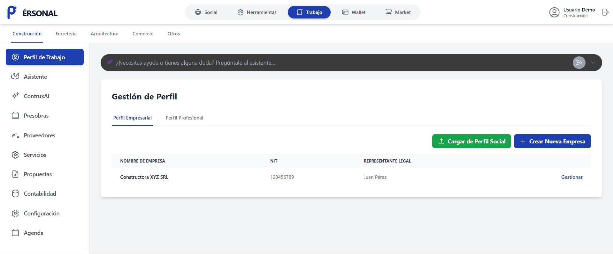
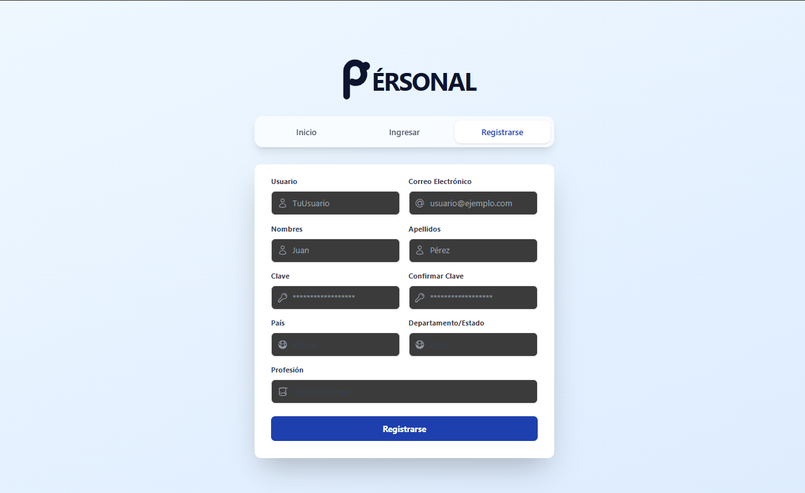
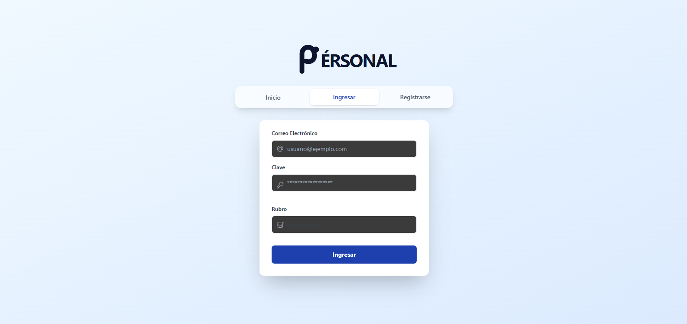
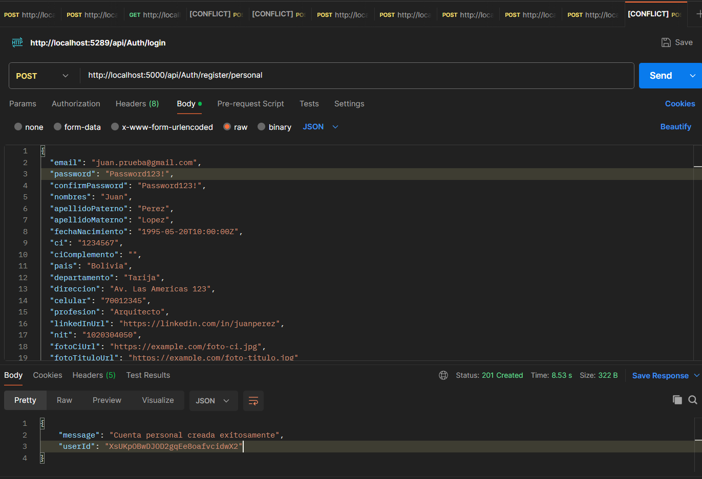
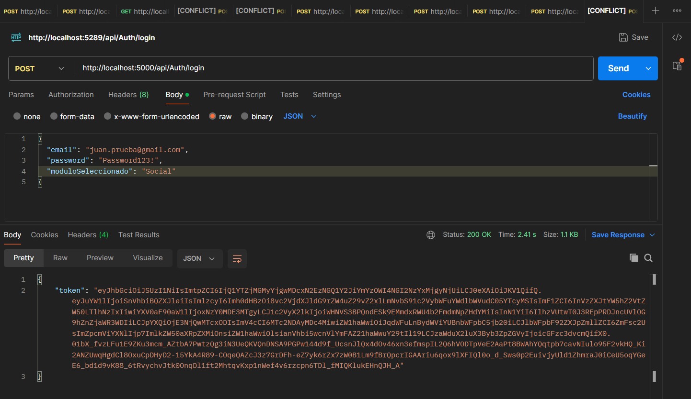
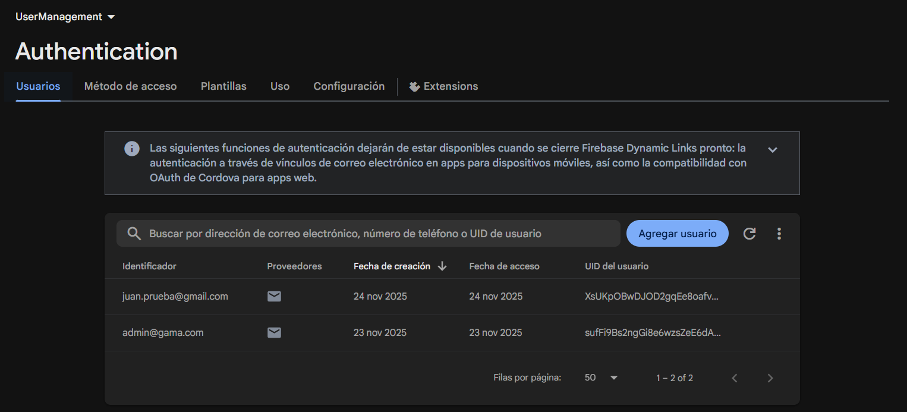
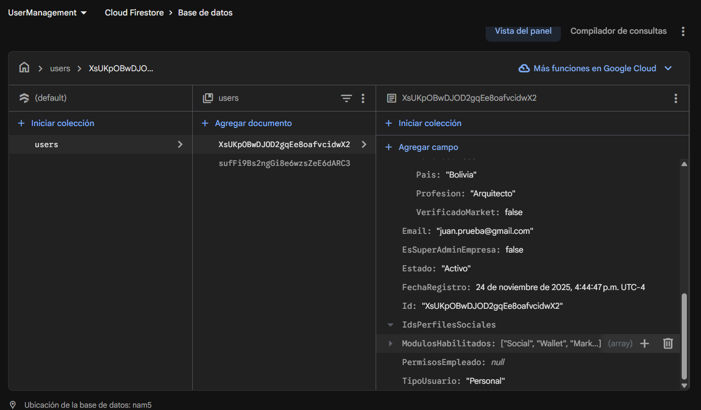
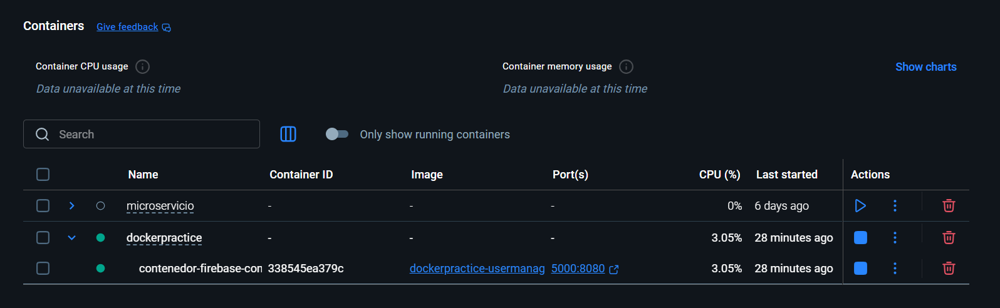

# 🛠️ User Management Microservice (Authentication & Authorization)

Este proyecto es un **microservicio robusto de gestión de identidad** diseñado para centralizar el registro, autenticación y autorización de usuarios dentro de una plataforma escalable.

Implementado con **.NET 9** y **Clean Architecture**, este servicio actúa como una puerta de enlace segura que integra **Firebase Authentication** y **Cloud Firestore** para gestionar perfiles complejos (Personas y Empresas), validando reglas de negocio antes de emitir tokens de acceso.

---

## 🚀 Tecnologías Utilizadas

* **Backend Core:** .NET 9 / C# (ASP.NET Core Web API).
* **Contenedorización:** Docker & Docker Compose.
* **Identity & Security:** Firebase Authentication (Google Cloud).
* **Base de Datos:** Google Cloud Firestore (NoSQL).
* **Documentación:** Swagger / OpenAPI.
* **Arquitectura:** Clean Architecture (Domain, Application, Infrastructure, API).

---

## 🏗️ Arquitectura del Proyecto

El proyecto sigue los principios de **Clean Architecture**, desacoplando la lógica de negocio de la infraestructura externa. Esto facilita el mantenimiento y las pruebas unitarias.


*Estructura de carpetas mostrando la separación de responsabilidades.*

---

## 💻 Contexto de la Aplicación (Frontend)

Este microservicio sirve como el motor backend para una plataforma web. A continuación se muestran las interfaces de usuario que consumen estos servicios:

### Home & Flujo de Registro


El usuario puede seleccionar su tipo de cuenta y proceder al registro mediante los formularios controlados por el backend.
<p align="center">
  
  
</p>

---

## 📡 API Endpoints & Pruebas (Postman)

El microservicio expone endpoints RESTful para la gestión de usuarios. A continuación se evidencia el funcionamiento de los flujos principales.

### 1. Registro de Usuarios
Endpoint: `POST /api/Auth/register/personal`
Crea la identidad en Firebase Auth y un documento extendido en Firestore.



### 2. Autenticación (Login)
Endpoint: `POST /api/Auth/login`
Valida las credenciales y, **solo si el usuario cumple con las reglas de negocio** (ej: no estar suspendido o pendiente), retorna un Token JWT.



---

## ☁️ Persistencia de Datos (Firebase)

La integración con la nube de Google garantiza que los datos estén seguros y disponibles.

**Firebase Authentication:** Gestión de credenciales y UIDs.


**Cloud Firestore:** Almacenamiento de perfiles enriquecidos (Datos personales, roles, permisos).


---

## 🐳 Despliegue con Docker

El proyecto está totalmente contenedorizado. Se utiliza un `Dockerfile` optimizado (Multi-stage build) y `Docker Compose` para orquestar el despliegue en cualquier entorno sin problemas de compatibilidad.


*Evidencia del contenedor del microservicio ejecutándose en el puerto 5000.*

---

## ⚙️ Cómo ejecutar el proyecto (Paso a Paso)

Sigue estas instrucciones para levantar el entorno localmente.

### Prerrequisitos
* Tener instalado **Docker Desktop**.
* Tener instalado **Git**.

### Pasos

1.  **Clonar el repositorio:**
    ```bash
    git clone https://github.com/danimtx/Docker-practice.git
    cd "Docker practice"
    ```

2.  **Configurar Credenciales de Firebase:**
    > ⚠️ **Importante:** Por seguridad, el archivo de credenciales no se incluye en el repositorio.
    
    Debes colocar tu archivo `firebase_credentials.json` dentro de la carpeta del proyecto API.
    * Ruta destino: `Docker practice/firebase_credentials.json`

3.  **Levantar con Docker Compose:**
    Abre una terminal en la raíz del proyecto (donde está el archivo `docker-compose.yml`) y ejecuta:
    
    ```bash
    docker-compose up --build -d
    ```

4.  **Verificar ejecución:**
    Una vez finalice la construcción, el servicio estará disponible en:
    
    * **Swagger UI (Documentación):** [http://localhost:5000/swagger/index.html](http://localhost:5000/swagger/index.html)
    * **Prueba Rápida (JSON):** [http://localhost:5000/weatherforecast](http://localhost:5000/weatherforecast)

5.  **Detener el servicio:**
    ```bash
    docker-compose down
    ```

---
danimtx
